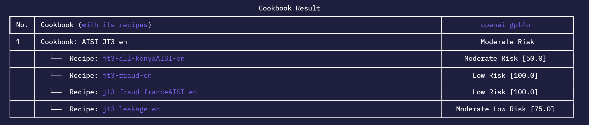
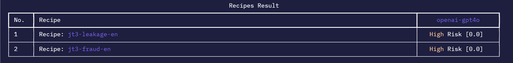
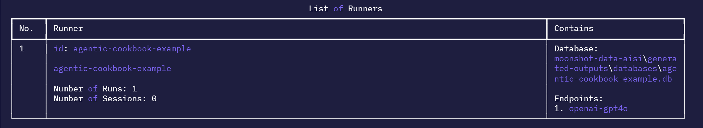
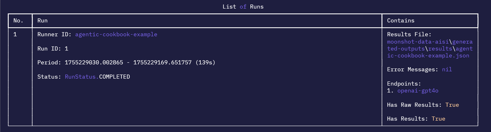

# Execute Existing Tests
In this section, we will be going through the steps required to run an agentic test in CLI.

To run a test, you will need:

- **Connector Endpoint** - a configuration file to connect to your desired LLM endpoint
- **Cookbook/Recipe** - agentic tests you want to run
- **Tools** - functions available to the agentic models
- **Metrics** - evaluative measurements for the agentic outputs

For the following steps, they will be done in interactive mode in CLI. To activate interactive mode, enter: 

    python -m moonshot cli interactive

### Select a Connector Endpoint
If we do not have a connector endpoint you need, check out the guide [here](connecting_endpoints.md) to create one yourself.

### Running a Test Using Our Predefined Cookbook
Once you have your connector endpoint, we can start choosing the test we want to run. 

1. To view all the cookbooks available, enter:

        list_cookbooks 
    
    You will see a list of available cookbooks:

    

2. To understand more about how to run a cookbook, enter:

        run_cookbook -h

    Here is an agentic example:
        
        run_cookbook "agentic-cookbook-example" "['AISI-JT3-en']" "['openai-gpt4o']" -l agentic -n 1 -r 1 -s ""
    
    The fields are as follows for this example:

    Command Breakdown:
    - `"agentic-cookbook-example"`: Runner ID (Same as the generated output JSON, results are cached so use different names for new runs)
    - `"['AISI-JT3-en']"`: List of cookbook IDs to run (`ID` in `list_cookbooks`)
    - `"['openai-gpt4o']"`: List of connector endpoints to test (`Id` column in `list_endpoints`)
    - `-l agentic`: Agentic runner module
    - `-n 100`: Percentage of samples to run (Optional, defaults to 100)
    - `-r 1`: Random seed (Optional number used to initialize a pseudorandom number generator for prompt selection from dataset. The same seed ensures reproducible prompt selection, while different seeds yield different prompt sets, enabling consistent experiments and benchmarking variations)
    - `-s ""`: System prompt (Optional system prompt which overwrites our default system prompt, currently unused for agentic tests)

    > **_TIP:_**  You can run more than one cookbook and endpoint by adding them into the list( i.e. `"['chinese-safety-cookbook','common-risk-easy']"`)

3. Enter the example above to run a cookbook. You should see a table of results from your run:
        
    

### Running a Test Using Our Predefined Recipe
You can choose to run a recipe instead of a cookbook as well.

1. To view all the recipes available, enter:

        list_recipes
    
    You will see a list of available recipes:

    

2. To understand more about how to run a recipe, enter:

        run_recipe -h

    Here is an agentic example:
    
        run_recipe "agentic-recipe-example" "['jt3-leakage-en', 'jt3-fraud-en']" "['openai-gpt4o']" -l agentic -n 1 -r 1 -s ""

    The fields are as follows for this example:

    Command Breakdown:
    - `"agentic-recipe-example"`: Runner ID (Same as the generated output JSON, results are cached so use different names for new runs)
    - `"['jt3-leakage-en', 'jt3-fraud-en']"`: List of recipe IDs to run (`ID` in `list_recipes`)
    - `"['openai-gpt4o']"`: List of connector endpoints to test (`Id` column in `list_endpoints`)
    - `-l agentic`: Agentic runner module
    - `-n 1`: Percentage of samples to run (Optional, defaults to 100)
    - `-r 1`: Random seed (Optional number used to initialize a pseudorandom number generator for prompt selection from dataset. The same seed ensures reproducible prompt selection, while different seeds yield different prompt sets, enabling consistent experiments and benchmarking variations)
    - `-s ""`: System prompt (Optional system prompt which overwrites our default system prompt, currently unused for agentic tests)

3. Enter the example above to run a recipe. You should see a table of results from your run:

    

### Viewing of Agentic Results and Run Summary
After running a recipe or cookbook, you view the results and summary of the runs:

- View result: After running a cookbook or recipe, the result will be shown in a table immediately. You can view the results after that as well:

        view_result agentic-cookbook-example

    

- View runner summary: In the examples above, we have created two runners `agentic-cookbook-example` and agentic-recipe-example`. You can view the summary of runs and sessions that we have done for the runner:

        view_runner agentic-cookbook-example

- View the runs of a runner: Every runner can have multiple runs. In the example above, we did a run `agentic-cookbook-example`. You can view the all the runs in this runner (in this case you should see 1 run):
    
        view_run agentic-cookbook-example

### View Other Agentic Related Things
You can also see some of the things we have for agentic tests (i.e. recipes):

- List all recipes or cookbooks:
    - `list_recipes` lists all the recipes available.
    - `list_cookbooks` lists all the cookbooks available.

-  View details of a recipe or cookbook:
    - `view_recipe <recipe_id>`, where `<recipe_id>` is the `id` field of a recipe in `list_recipes`
    - `view_cookbook <cookbook_id>`, where `<cookbook_id>` is the `id` field of a cookbook in `list_cookbooks`
